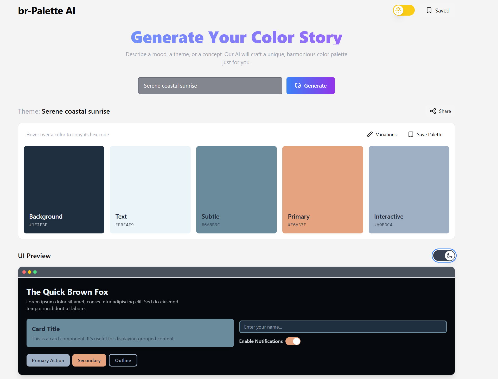
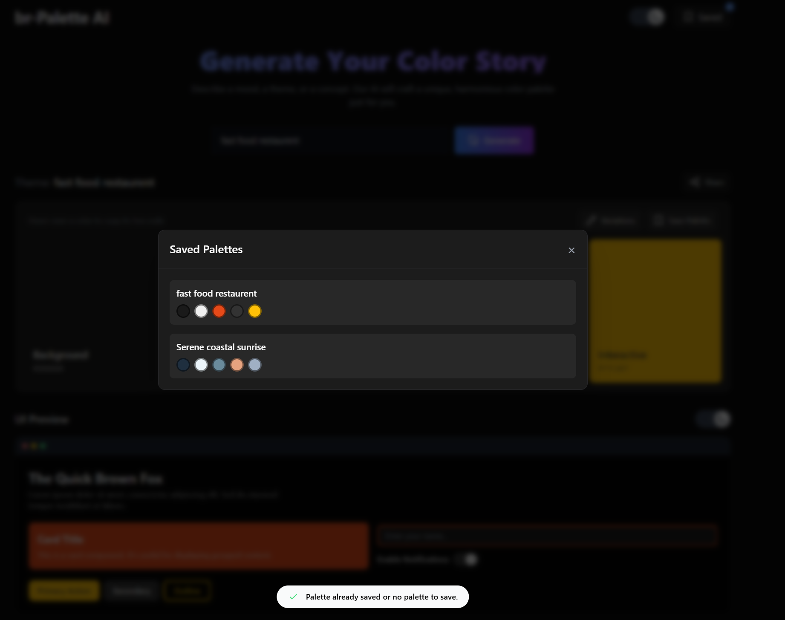

# br-Palette AI

br-Palette AI is a modern, AI-powered color palette generator designed for creatives, designers, and developers. Simply describe a mood, theme, or concept, and the application leverages Google's Gemini API to generate a beautiful and harmonious 5-color palette, complete with semantic naming to guide your design process.




## ✨ Features

- **AI-Powered Generation**: Get unique color palettes from a simple text description (e.g., "Misty forest morning," "Cyberpunk cityscape").
- **Semantic Naming**: Colors aren't just hex codes; they come with descriptive names like "Background," "Primary," or "Accent" to inform their use.
- **Instant UI Preview**: See how your generated palette looks on a sample UI component layout, providing immediate context.
- **Light & Dark Mode**: Preview your colors in both light and dark themes within the UI preview to ensure accessibility and versatility.
- **Generate Variations**: Not quite right? Create four subtle variations of your current palette with a single click to explore adjacent possibilities.
- **Save Favorites**: Store your favorite palettes in your browser's local storage for easy access later.
- **Copy & Share**: Easily copy hex codes to your clipboard or share a unique URL that will load your exact palette for others.
- **Responsive Design**: A clean, modern, and fully responsive interface that works beautifully on any device.

## 🛠️ Tech Stack

- **Frontend**: React with TypeScript
- **Styling**: Tailwind CSS for a utility-first styling workflow.
- **AI Model**: Google Gemini API (`gemini-2.5-flash`) for fast and high-quality palette generation.
- **State Management**: React Hooks (`useState`, `useEffect`) and a custom `useLocalStorage` hook for persistence.
- **Build Tool**: Vite (as implied by the project setup).

## 🚀 Getting Started

Follow these instructions to get a copy of the project up and running on your local machine for development and testing purposes.


### Installation

1.  **Clone the repository:**
    ```bash
    git clone https://github.com/BenazizaAbdelkaderRiyadh/ai-color-palette-generator.git
    cd br-palette-ai
    ```

2.  **Install dependencies:**
    ```bash
    npm install
    # or
    yarn install
    ```

3.  **Set up environment variables:**
    Add your Gemini API key:
    ```
    API_KEY="YOUR_GEMINI_API_KEY"
    ```

4.  **Run the development server:**
    ```bash
    npm run dev
    # or
    yarn dev
    ```

## 🎨 How to Use

1.  **Enter a Prompt**: In the input field, describe the feeling, theme, or concept for your desired palette.
2.  **Generate**: Click the "Generate" button. The AI will create a 5-color palette based on your prompt.
3.  **Review and Copy**: Hover over any color in the main display to copy its hex code.
4.  **Preview**: Scroll down to the UI Preview section to see your colors applied to a sample interface. You can toggle the preview between light and dark modes.
5.  **Generate Variations**: If you like the palette but want to see alternatives, click the "Variations" button.
6.  **Save**: Click "Save Palette" to store the current palette in your browser.
7.  **View Saved**: Access all your saved palettes by clicking the "Saved" button in the header. From there, you can load or delete them.
8.  **Share**: Click the "Share" button to copy a unique link to your clipboard that you can send to others.




## 📁 Project Structure

```
/
├── public/
├── src/
│   ├── components/      # Reusable React components (Header, Button, etc.)
│   ├── hooks/           # Custom React hooks (useTheme, useLocalStorage)
│   ├── services/        # API interaction logic (geminiService.ts)
│   ├── utils/           # Helper functions (colorUtils.ts)
│   ├── App.tsx          # Main application component
│   ├── index.tsx        # Entry point for React
│   └── types.ts         # TypeScript type definitions
├── .env                 # Environment variables (API Key)
├── index.html           # Main HTML file
└── README.md
```


## 📄 License

This project is licensed under the MIT License - see the `LICENSE` file for details.
